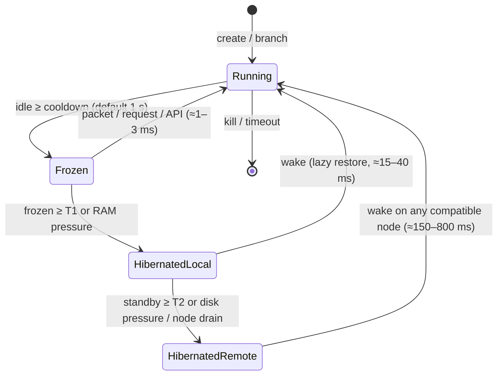
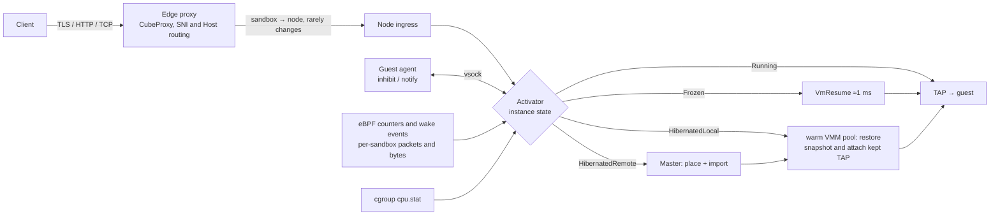

# Design: a scale-to-zero agent cloud on CubeSandbox + Cloud Hypervisor

Status: proposal, 2026-09-26. Code baseline `c33a8a5e` (v0.7.2). Unikraft Cloud facts are from its public docs and blog as of 2026-09-26. Vendor latency numbers are claims, not benchmarks.

## 1. Goal

Build an open alternative to Unikraft Cloud for AI-agent and multi-tenant workloads:

- Idle instances scale to zero automatically, about 1 s after the last activity.
- An idle instance wakes in one round trip of the first request or packet, with its memory state intact.
- Thousands of standby instances fit per node, and hundreds run concurrently.
- Tenants are isolated from one another, with per-tenant quotas and usage metering.
- It is E2B-compatible, and adds Unikraft-style services, templates, branch/checkpoint and scale-to-zero policies.

### Target SLOs (end-to-end: first byte in at the edge → first byte out of the app)

| Wake from | Target p50 / p99 | CubeSandbox today (from docs, xfs backend) |
|---|---|---|
| **Frozen** (VM alive, vCPUs paused, RAM resident) | ≤ 3 ms / 10 ms | not used by auto-pause |
| **Hibernated-local** (snapshot on local NVMe, no VMM process) | ≤ 25 ms / 80 ms (aspirational until Phase 0) | resume ≈ 42–154 ms, plus control-plane hops; CoW restore to first HTTP response 97–130 ms warm median (section 9) |
| **Hibernated-remote** (snapshot only in S3, any node) | ≤ 250 ms / 800 ms | cross-node resume ≈ 836 ms avg |
| Create from template | ≤ 40 ms / 120 ms | 48–56 ms avg at c=1; 276 ms avg at c=50 |
| Branch a live instance | ≤ 30 ms of source downtime, for a source with ≤ 64 MiB dirtied since its last snapshot | clone 220 ms single; 8.7 ms amortized |

The Hibernated-local target has no measured support yet: today's restore path takes 4–5× longer, and the savings from the warm VMM pool (4.3) are unmeasured. Phase 0 either confirms that the budget in 4.3 can reach it or resets it.

Branch downtime scales with the memory the source has dirtied, not with fixed overhead, so the target states that bound.

Unikraft claims "< 10 ms" for cold start, stateful resume and branch. Its own API examples show 76–211 ms boot times, and it says the first requests after a lazy restore are slower. The realistic benchmark for us is application-ready latency, not VMM-restore time.

## 2. What Unikraft Cloud actually does

- **VMM and guest:** a closed, heavily modified Firecracker fork. The guest is either the Unikraft unikernel (single process, run through an ELF loader) or "TinyX", a trimmed Linux. GPUs need a separate QEMU instance type, which loses scale-to-zero, templates, branching and snapshots.
- **Images:** OCI images built from a Dockerfile with BuildKit. The rootfs is EROFS and is paged in from disk on demand. Kernel-less images boot the node's kernel.
- **Scale-to-zero policies:** `off`, `on` and `idle`. `on` puts an instance in standby when it has no connections or requests. `idle` suspends even with idle TCP connections open, and an incoming packet wakes it. The default cooldown is 1000 ms. `stateful=true` snapshots the instance before standby and restores it lazily on the next access.
  - The guest can hold a reference-counted inhibit at `/uk/libukp/scale_to_zero_disable`.
  - The platform sends a pre-suspend notification over vsock port 138.
- **Wake path:** "the proxy buffers the request, the controller resumes the instance, the VMM brings it live, all within a single round trip." A node-local ingress controller does this. Internal traffic to `<name>.internal` also wakes instances.
- **Networking at scale:** they dropped per-VM TAP devices beyond about 50K VMs because of kernel lock contention, and moved to shared-memory devices and vsock.
- **Templates and branching:**
  - The app marks itself as a template at the moment it chooses.
  - All instances are spawned from that one snapshot.
  - `branch_from` gives a few ms of downtime on the source.
  - Named checkpoints have lineage.
- **Snapshots:** differential and compressed, restored without decompressing first, and tiered across RAM, NVMe and compressed disk.
- **Density claim:** "1M VMs on a box" counts **standby** instances, which are snapshots on disk, not running VMs.
- **Weaknesses we can beat:**
  - The core is closed source.
  - GPUs and snapshots don't work together.
  - Compatibility is limited: unikernel or trimmed Linux, root only.
  - The load balancer rejects requests at its hard limit instead of queueing them.
  - Most advanced features are enterprise-only, and pricing is by capacity slot rather than metered.

Other platforms for comparison: Koyeb (Cloud Hypervisor, eBPF idle detection, about 200 ms light sleep, relies on SYN retransmit), Blaxel (resume < 25 ms), CodeSandbox (live VM clone, zstd page chunks), E2B (≈ 1 s resume), Fly (suspend, "hundreds of ms").

## 3. What CubeSandbox already gives us

Strong foundations:

- **Hypervisor:** a Cloud Hypervisor fork (v28) embedded in the per-sandbox shim, with snapshot/restore and incremental snapshots (anon-pagemap, soft-dirty, dirty log).
- **Lazy memory restore:** restore uses a lazy `MAP_PRIVATE` mmap (`hypervisor/vmm/src/memory_manager.rs:1515`), so all clones of a template share its clean pages through the page cache.
- **Rootfs:** the template rootfs is a shared read-only DAX pmem image, with a reflinked writable layer on top.
- **Pre-created pools:** disks, cgroups and TAPs are pre-created, which is why create-from-template takes about 50 ms.
- **Networking:** eBPF networking (CubeVS). Every guest has the same IP, so snapshots don't depend on network configuration.
- **Egress:** CubeEgress already does L7 egress with credential injection. That is the equivalent of Unikraft's "network shield".
- **Ingress and wake:** CubeProxy routes `<port>-<id>.<domain>` to sandboxes, and **already wakes paused sandboxes on HTTP requests** (`CubeProxy/lua/sandbox_state.lua`) by calling the lifecycle manager (CLM).
- **Cross-node:** snapshots move between nodes through CubeS3lvol/cubecow, with origin-first placement.
- **API:** E2B-compatible API, with snapshot/rollback/volume extensions and SDKs.
- **Shim primitives:** plain in-RAM pause and resume already exist (`CubeShim/shim/src/hypervisor/cube_hypervisor.rs:164`, `:174`). They are already reachable through the containerd task `pause`/`resume` API (`CubeShim/shim/src/service/task_srv.rs:990`, `:1015`), but no lifecycle path uses them.

The gaps that matter for this goal:

| # | Gap | Where | Impact |
|---|---|---|---|
| G1 | "Pause" always means snapshot plus **destroying the VM** (`hypervisor/vmm/src/lib.rs:689` `vm_pause_to_snapshot` → `vm_delete`). Resume builds a new VM, recreates its TAP and ports, and rewrites the proxy route. | Master `sandbox_resume_pause.go`, Cubelet `pause_cow.go` | No ms-level tier; every wake pays for VM creation. |
| G2 | Waking goes through Proxy → CLM → Master (Redis lock) → Cubelet gRPC → containerd → shim. | CubeProxy, CLM, Master | Wake latency is bounded by the control plane, not the VMM. |
| G3 | Idle is detected only from HTTP traffic through CubeProxy, sampled every 5 s. | CLM `internal/config`, `log_phase.lua` | Idle instances can't be suspended after about 1 s. Raw TCP/UDP, internal traffic and outbound LLM streams are invisible. |
| G4 | Only HTTP requests can wake an instance. | CubeProxy | Raw TCP (databases, websockets on host ports) and instance-to-instance traffic can't wake anything. |
| G5 | No tenant model. There is only a `Namespace` field, defaulting to `"default"`. Auth is either one shared key or a callback. | CubeAPI, Master | Blocks multi-tenant use. |
| G6 | The VMM runs without a jailer, user namespace or privilege drop. The guest boots with `mitigations=off`. Internal ports (`:9998`, `/internal/*`) are unauthenticated. | CubeShim, `config.rs` | Not acceptable for hostile multi-tenant agents. |
| G7 | No working-set prefetch and no compressed snapshots. Cross-node memory is always fully decoupled. | cubecow, CubeS3lvol | Cross-node wakes are slow, and storage cost is high. Addressed in roadmap phase 4. |
| G8 | Paused instances hold their full quota by default. There is no admission control for overcommit. | Cubelet `paused_resource_release_ratio` | Density is limited. |
| G9 | Snapshots only restore onto an identical kernel, agent, OS image, CPUID and host kernel. | `CubeShim/shim/src/hypervisor/snapshot.rs` `SnapshotInfo::eq`, `placement.go` | Upgrades invalidate standby fleets. |

## 4. Architecture

### 4.1 The instance state ladder

The core idea is to replace the single "paused" state with a ladder of tiers. Each tier trades resources for wake latency, and a **node-local** controller moves instances between them without asking the control plane.



| Tier | What stays alive | Memory cost | Implementation |
|---|---|---|---|
| **Running** | everything | full working set | today |
| **Frozen** | VMM process, KVM VM, TAP, vsock, guest RAM | resident guest RAM. Mitigated by returning free pages through balloon free-page reporting (already on) and, later, reclaiming cold clean pages | `VmPause` / `VmResume` already exist in the shim and are reachable through the containerd task `pause`/`resume` API. New work: drive them from the node activator, either through that API or directly over the shim's socket (decided with risk 7 in section 8). |
| **Hibernated-local** | snapshot on NVMe; network identity (TAP or queue); route | disk only; template pages stay shared in the page cache | today's pause-to-snapshot, with a warm VMM pool, a kept TAP and no Master hop |
| **Hibernated-remote** | snapshot in S3 | S3 only | today's S3 backend, plus working-set prefetch (roadmap phase 4) |

Two rules make the ladder fast:

1. **Snapshot while frozen, but not on every freeze.** With a 1 s cooldown a chatty agent freezes many times a minute, so snapshotting on every freeze would cost constant NVMe writes and CPU. Instead, start an incremental snapshot to local NVMe only once an instance has stayed Frozen for a snapshot delay (a fraction of T1), or earlier when node memory pressure is rising. The guest is already paused, so the snapshot is consistent. Frozen → Hibernated-local then usually only has to free RAM and exit the VMM.
   - `VmSnapshot` cannot be cancelled partway today. A wake that arrives during a snapshot waits for it to finish. Phase 2 either makes the snapshot abortable, or measures this wait and accepts it as a p99 cost of instances that were Frozen long enough to be snapshotted.
2. **Stay on the same node.** Hibernated-local instances stay on their node, so edge routing never changes and a wake never needs placement. Only Hibernated-remote wakes and node drains involve the Master.
   - Durability follows from this: until an instance reaches Hibernated-remote (T2), its only memory state is on one node, and losing that node loses the state. `stateful: true` guarantees state across scale-to-zero, not across node failure. A tenant that needs the stronger guarantee sets a short `archive_after_ms`.

### 4.2 Node-local activator (fixes G2, G3, G4)

Add an **activator** to each node, either as a Cubelet plugin or a small Rust daemon next to it, that owns the hot state machine for every instance on the node.



**Idle detection (node-local, 100 ms tick).** An instance is idle only when **all** of these hold for the whole `cooldown_ms`:

- **Network:** per-sandbox eBPF packet counters show no packets in either direction. This covers ingress, egress, internal and raw TCP. These counters are new code, and the two directions go in different places:
  - Guest → host: `from_cube`, the only TC program on the TAP (`CubeNet/src/mvmtap.bpf.c:955`).
  - Host → guest: nothing hooks the TAP itself. Traffic is sent into it with `bpf_redirect` from `from_world` (`CubeNet/src/nodenic.bpf.c:480`, external traffic), `from_envoy` (`CubeNet/src/localgw.bpf.c:68`, CubeProxy traffic) and the NAT redirects in `mvmtap.bpf.c` (sandbox-to-sandbox traffic). Count at those redirect points, which already know the destination sandbox.
- **CPU:** vCPU usage from cgroup `cpu.stat` is below a small threshold, so batch jobs with no traffic still count as busy.
- **Guest agent:** there are no active inhibits. The guest agent (`cube-agent` or envd) takes an inhibit for each running `exec`, streaming PTY or process-API call. Apps can also take one explicitly through a guest API such as `/run/cube/scale_to_zero_disable`, mirroring Unikraft's `/uk/libukp` interface.
- **Policy:**
  - `off` never suspends.
  - `on` requires no open ingress connections (conntrack in CubeVS).
  - `idle` allows open but silent connections. TCP keepalives would otherwise keep such connections from ever looking silent, so the network counters skip bare ACKs without payload.

Before freezing, the activator sends the guest a `pre-suspend` notification over vsock with a short deadline, so it can flush logs or checkpoint. The instance is suspended even if the guest doesn't respond.

**Wake triggers:**

- **Packets while Frozen:** the VMM stops reading the TAP fd, so incoming frames queue in the TAP (sized by `txqueuelen`). The eBPF program that redirects a packet into a frozen instance's TAP (see the network idle signal above) also sends an event through a BPF ring buffer, and the activator calls `VmResume`. The queued frames are then delivered, and TCP never notices. This is how an **outbound LLM stream wakes the agent**: the response packets themselves are the trigger.
- **Packets while hibernated:** a TAP with no open queue fd drops frames on transmit, and a queue's pending frames are freed when its fd closes. So the activator holds a dup of the TAP queue fd before the VMM exits, keeps it open across hibernation, and passes it to the restored VMM over SCM_RIGHTS. Frames that arrive meanwhile queue up to `txqueuelen` and are delivered after restore. For long wakes, the edge proxy must hold the connection rather than rely on SYN retransmission (Koyeb's approach, which costs about 1 s).
- **HTTP through the edge:** the edge proxy forwards to the node ingress, which blocks the request until the activator reports the instance Running. Queue the request instead of rejecting it; this is an advantage over Unikraft.
- **API calls:** calls such as `exec`, `files` and `connect` go to the activator first.

**Moving the pause/resume state out of the Master.** The activator is the source of truth for the Running, Frozen and Hibernated-local transitions. It publishes each transition asynchronously (a Redis stream, or directly to the metering pipeline). The Master keeps desired state, placement, Hibernated-remote and relocation.

- API reads of instance state from the Master can therefore lag behind the activator. Treat Running, Frozen and Hibernated-local as one externally visible state (for example, `running` with a `standby` detail), so stale reads never change what a client should do.
- User-initiated operations that change these states (E2B pause, resume, kill, and branch) go through the activator, which serializes them with its own transitions per instance. The Master never changes a local tier directly. Most of today's CLM logic (sweeping, leader lease, polling `/admin/last_active`) is replaced by the activator. CLM shrinks to a global policy and timeout reaper.

### 4.3 Warm restore path (Hibernated-local, target ≤ 25 ms)

The target budget, to be checked against Phase 0 measurements. Today's end-to-end restore takes about 100 ms warm (section 9), so the rows marked 0 have to account for roughly 75 ms. Phase 0 shows whether they do.

| Step | Today | Target | Technique |
|---|---|---|---|
| Control-plane hops | Proxy → CLM → Master → Cubelet | 0 | the activator is local |
| Shim and VMM process spawn, containerd task create | per wake | 0 | a **pool of pre-spawned VMM processes**, each with its KVM VM fd and seccomp already set up and its cgroup assigned, waiting for a `RestoreConfig`. Use a direct restore RPC that bypasses containerd's create path for wakes. |
| TAP, ports, proxy route | recreated | 0 | keep the network identity across hibernation |
| VM state and device restore | ~ms | ~ms | today |
| Memory | lazy mmap | lazy mmap, plus working-set prefetch into the page cache | record startup ranges, then `readahead`/`MADV_POPULATE_READ` before resuming vCPUs (REAP-style) |
| Guest readiness | vsock agent reconnect | reuse the vsock connection handshake. The guest doesn't reboot; it resumes. | |

**Guest clock and TCP after a resume:**

- On every resume, send the guest agent a time-sync (kvm-clock plus `clock_settime`, or a PTP-KVM based chrony setup), so TLS and JWT expiry checks stay correct.
- Document that peers of a hibernated instance may time out long-lived TCP connections.
- Frozen instances get this for free if T1 (the time before a Frozen instance is hibernated) is short relative to typical keepalive timeouts.

### 4.4 Memory and density (fixes G8)

- **Frozen tier:**
  - Keep balloon free-page reporting on.
  - Add an idle-time guest hint that drops the page cache inside the guest before freezing (optional per template).
  - Budget Frozen memory per node with an LRU. When the budget is exceeded, the least recently used Frozen instances are hibernated first, and their snapshot is usually already done (rule 1 in 4.1).
- **Shared template pages:** restores from one template `mmap` the same snapshot file, so clean pages are shared through the page cache. That is the main density lever for the "many agents from one template" workload.
  - Keep the restore path on this copy-on-write mapping. Any memory feature that copies pages into anonymous per-VM RAM loses this sharing.
- **Snapshot format:** a chain of base template plus per-instance deltas, with bounded depth and flattened in the background. Compress at the storage layer (CubeS3lvol objects, or filesystem compression on the local tier), so the VMM keeps mapping a plain block device or file.
- **Accounting and admission:** schedule on committed resources. Running and Frozen instances count their resident set (PSS, i.e. proportional set size); Hibernated instances count only disk. Keep a per-node overcommit ratio with a hard floor. Replace `paused_resource_release_ratio` with this accounting.
- **Standby scale:** 10K+ hibernated instances per node is mostly a metadata and TAP problem.
  - Phase 1 keeps TAPs; about 10K TAPs is fine.
  - Past about 50K, move to a vhost-user-net backend or a shared-memory/vsock data path, as Unikraft did, with CubeVS logic in the backend.

### 4.5 Multi-tenancy and hardening (fixes G5, G6)

- **Data model:** `Tenant` → `Project` → API keys (scoped, hashed) → instances, templates, snapshots, volumes, services. This model lives in a **tenant gateway** in front of CubeAPI, not in Master models, so the fork's Master and Redis schema stay as upstream has them (section 7).
  - The gateway resolves the API key to a tenant and keeps its own table of which tenant owns each sandbox, template, snapshot and volume. It filters every list call and rejects get, update and delete calls on resources the tenant doesn't own.
  - The gateway sets the sandbox's existing `Namespace` field to the tenant ID on create, so node-level components (activator, metering, CubeNet) can tell tenants apart. Today CubeAPI doesn't pass `Namespace` to the Master, and the Master stores it without filtering on it. So the fork adds one small CubeAPI change: forward the namespace from a gateway-set header.
  - Templates are one global namespace in CubeAPI today (`CubeAPI/src/services/templates.rs`). The gateway prefixes tenant template names so tenants cannot collide or see each other's templates.
  - CubeAPI, Master and the CubeProxy admin API must be reachable only from the gateway and internal services, never directly by tenants.
- **Quotas per tenant:** running vCPU and RAM, Frozen RAM, number of standby instances, snapshot bytes, egress bandwidth and creates per second. The gateway enforces them at admission, from its ownership table and the activator's transition events. The Master's placement stays per node and doesn't know about tenants.
- **Network:**
  - Instances are isolated by default.
  - An opt-in per-tenant private network provides `<name>.<project>.internal` DNS, enforced in CubeVS LPM maps keyed by tenant.
  - Internal traffic also wakes instances (4.2).
- **Host hardening (release gate for multi-tenant use):**
  - Run each shim and VMM in its own user namespace with an unprivileged uid, chroot or pivot_root, and a minimal `/dev`. This is the Firecracker jailer model, applied to the shim, which embeds the VMM in-process.
  - Tighten seccomp to the restore and runtime subset.
  - Enable guest `mitigations` by default, with an opt-out only for single-tenant or dedicated nodes.
  - Put mTLS on Cubelet `:9998`, `/internal/*` and the CubeProxy admin API.
  - Optionally schedule by tenant on dedicated cores to limit SMT side channels.
- **Snapshot confidentiality:**
  - Encrypt snapshots at rest with per-tenant keys (S3 SSE-C or envelope encryption in CubeS3lvol).
  - Scope cache keys and dedup by tenant. Cross-tenant page sharing is allowed only for public base templates, never for tenant deltas.
  - Keep KSM (kernel same-page merging) off across tenants.
- **Metering:** from activator transition events, charge per ms of Running vCPU and RAM, per ms of Frozen RAM, per GB-hour of Hibernated storage, and per egress GB. This is exact because the activator owns every transition.

### 4.6 API surface

Keep the E2B-compatible API. Add Unikraft-style primitives as extensions:

```yaml
POST /v1/instances
  template: py-agent@v3            # or image + Kraftfile-like spec
  vcpus: 2, memory_mb: 2048
  scale_to_zero:
    policy: idle                   # off | on | idle
    cooldown_ms: 1000
    stateful: true                 # false = restart from template instead of restoring state
    hibernate_after_ms: 30000      # T1: Frozen → HibernatedLocal
    archive_after_ms: 3600000      # T2: → HibernatedRemote
  service: {name: web, ports: [{port: 443, handler: [tls, http], target: 8080}]}
  network: {tenant_private: true, egress_policy: default-deny, secrets: [OPENAI_KEY]}
POST /v1/instances/{id}/branch     # N live copies from a Frozen point (sub-agent tree search)
POST /v1/instances/{id}/checkpoints / .../rewind
POST /v1/templates  {from_instance: id}   # the app can also call "template-me" through a guest API
```

Features aimed at agent workloads:

- **Branch** freezes the source, takes an incremental snapshot, and resumes the source. Children restore from the delta with shared base pages.
- **Checkpoint and rewind in place** use the existing Rollback operation.
- **Egress secret injection** already exists in CubeEgress: the agent never sees the real key.
- **Browser templates** are pre-warmed Chromium snapshots.

## 5. Hypervisor strategy

- **Stay on Cloud Hypervisor** rather than Firecracker. It gives:
  - VFIO GPU passthrough on the same VMM as snapshots. This is a real gap in Unikraft's offering, though GPU snapshots themselves remain hard.
  - virtio-pmem DAX, which the rootfs sharing depends on.
  - Hotplug.
  - The existing fork investment.
- **Keep the v28 fork** and its copy-on-write restore path. Decide on a v5x rebase as its own project once the state ladder is stable.
- **Snapshot portability (G9):**
  - Version the snapshot format and record a host-facts fingerprint.
  - Run compatibility pools during upgrades.
  - For long-lived standby fleets, add a "rehydrate" path. The snapshot records the template, the filesystem delta and an app-level checkpoint hook, so an instance whose memory snapshot has become incompatible can cold-boot from the new template and replay its filesystem state. This matches Unikraft's `stateful=false` semantics and Vercel's filesystem snapshots.

## 6. Roadmap

Each phase ends with a measured gate. Don't move to the next phase on design confidence alone.

| Phase | Deliverable | Main code | Gate |
|---|---|---|---|
| **0. Baseline** (1–2 wk) | End-to-end wake tracing: edge → CLM → Master → Cubelet → shim → VMM → guest ready → first app byte. Record p50 and p99 per step for xfs, S3-local and S3-cross wakes, at c=1, 10 and 50. For S3-cross wakes, split the time into memory import, device activation, VMM restore, first page faults and guest startup, and record S3 GET count and bytes plus CubeS3lvol cache hits. Also a density baseline: PSS per Running and per Paused instance. | CubeProxy, CLM, Master, Cubelet, shim stats | The budget table in 4.3 is filled in with real numbers. |
| **1. Frozen tier + activator** (4–6 wk) | A node activator with eBPF, cgroup and inhibit idle detection on a 100 ms tick. Frozen ⇄ Running through the existing `VmPause`/`VmResume`. TAP-queue wake on packets. The edge holds HTTP requests. Scale-to-zero policy fields in the API. Guest inhibit and pre-suspend over vsock. Time sync after resume. | new `Cubelet/activator` (or `cube-activator/`), `CubeNet/src/mvmtap.bpf.c`, `nodenic.bpf.c`, `localgw.bpf.c`, agent, CubeProxy, CubeAPI | Frozen wake p99 ≤ 10 ms. Outbound LLM stream wakes the agent correctly. No lost packets under load. |
| **2. Fast hibernate** (4–6 wk) | Delayed background snapshot while Frozen, abortable or with its wake cost measured. Hibernated-local transitions owned by the activator. Warm VMM process pool with direct restore. Network identity kept across hibernation, with the activator holding the TAP queue fd. Frozen memory budget with LRU hibernation. | shim, Cubelet `pause_*`, Master (drops out of the local path) | Hibernated-local wake meets the p50/p99 target at c=50, as confirmed or reset by Phase 0. Frames sent during hibernation are delivered after restore. Frozen wake p99 still ≤ 10 ms with snapshots running. |
| **3. Multi-tenancy + hardening** (6–8 wk, in parallel with 1–2) | Tenant gateway with the tenant, project and key model, resource ownership table and per-tenant quotas. `Namespace` forwarded as tenant ID. Per-tenant private networks. VMM jail (user namespace, chroot). mTLS on internal ports. Guest mitigations. Per-tenant snapshot encryption. Metering events. | tenant gateway (private), CubeAPI (namespace forwarding only), CubeVS, CubeShim, CubeS3lvol | A penetration-test checklist passes. Cross-tenant list, route and cache tests all deny. |
| **4. Remote tier** (6–10 wk) | Working-set prefetch: record the memory-volume ranges read during the startup window of a cross-node restore (with prefetch off), key the hint by snapshot identity and memory layout, and replay it into the page cache before vCPUs resume, with byte, bandwidth and concurrency limits. Compressed storage-layer objects. Cache-locality placement. | cubecow, CubeS3lvol, Master `restoreplace` | Cross-node p95 improves by ≥ 20% over Phase 0. No new corruption or lifecycle failures. |
| **5. Density and scale** (open-ended) | A TAP-less data path (vhost-user-net or shared memory) for 50K+ standby instances per node. Metadata scaling. Snapshot rehydrate across upgrades. GPU instances with the Frozen tier (GPU snapshot is research). | CubeNet, shim, Cubelet | Beats Unikraft's published standby-per-node and resume numbers on the same hardware class. |

Phases 1 and 2 give the biggest improvement for the least risk. The primitives exist (`VmPause`, `VmResume`, lazy mmap restore, TAP pools, eBPF per-TAP programs), and the work is mostly wiring the node-local control loop.

## 7. Code ownership: fork vs. private services

Rule: anything that runs on a node, sits in the sandbox data path, or enforces isolation goes in the CubeSandbox fork. Anything about customers, money or running the business goes in private services, which talk to the fork only through its APIs and event streams, never by patching its code.

CubeSandbox is Apache-2.0, so both private services and private changes to the fork are allowed. Check the third-party components listed in `LICENSE` before shipping modified binaries of them, such as a modified guest kernel. The fork is public but downstream only: nothing is proposed to upstream. The real cost is merging each upstream release, so the fork's changes to upstream files are kept small (see "Staying in sync with upstream" below).

### What the fork adds over upstream

All of this is proposed; the latency targets are unmeasured until Phase 0.

| Area | Upstream CubeSandbox | Fork |
|---|---|---|
| Idle → suspend | 5 s CLM sweep; HTTP traffic through CubeProxy only | about 1 s, detected on the node from packets, CPU and guest inhibits; covers raw TCP/UDP, internal and outbound traffic |
| Pause tiers | one: snapshot and destroy the VM | Frozen → Hibernated-local → Hibernated-remote (4.1) |
| Wake latency | resume ≈ 42–154 ms, plus Proxy → CLM → Master → Cubelet hops | Frozen ≤ 3 ms p50; Hibernated-local ≤ 25 ms p50 (aspirational); no control-plane hops |
| Wake triggers | HTTP requests only | any packet, including responses on an outbound LLM stream, instance-to-instance traffic and raw TCP |
| During a wake | 503 with Retry-After while a sandbox is mid-pause | the edge holds requests and packets queue in the TAP |
| Scale-to-zero policy | per-sandbox auto-pause opt-in | `off` / `on` / `idle`, cooldown, `stateful`, T1 and T2, guest inhibit and pre-suspend hook |
| Density | paused sandboxes hold their full quota by default | admission on committed resources; Frozen memory budget with LRU hibernation |
| Security | no jailer, `mitigations=off`, unauthenticated internal ports | jailed VMM, guest mitigations on, mTLS on internal ports, per-tenant snapshot encryption |
| Tenancy hooks | `Namespace` stored but unused | `Namespace` forwarded as tenant ID; per-tenant private networks; transition events for metering |
| Agent features | snapshot and rollback | branch into N live copies, checkpoints, working-set prefetch for cross-node wakes |
| Upgrades | snapshots invalidated by upgrades | versioned snapshots and a rehydrate path |

The fork alone is not a cloud product: accounts, the tenant gateway, quotas, billing and the console are private services (below). The largest gain for the least work is Phase 1: the Frozen tier and node activator move the common case, an agent idle for seconds to minutes, from roughly a hundred milliseconds to single-digit milliseconds, mostly with primitives that already exist.

### Fork (public)

| Component | Work from this design |
|---|---|
| hypervisor, CubeShim | Frozen tier, warm VMM pool, direct restore, holding the TAP queue fd, jail and seccomp, snapshot versioning |
| Activator (new, node-local) | idle detection, the state ladder, wake handling, publishing transition events |
| CubeNet | per-sandbox counters, wake events, per-tenant private networks |
| Cubelet | admission based on committed resources |
| CubeMaster, CubeAPI | forwarding `Namespace` as the tenant ID, scale-to-zero API fields, branch and checkpoint. No tenant fields in Master models or Redis keys. |
| CubeProxy | holding requests during a wake, mTLS on internal ports |
| cubecow, CubeS3lvol | prefetch, compression, per-tenant encryption keys |
| Metering | emitting raw usage events (Running ms, Frozen ms, storage, egress) |

The fork knows a tenant only as an opaque tenant ID in the `Namespace` field. It doesn't know who the customer is, what they own, or what they pay.

### Private services

| Service | Responsibility |
|---|---|
| Tenant gateway | the only public entry to CubeAPI: resolves API keys to tenants, owns the resource ownership table, filters and authorizes every call, enforces quotas, sets `Namespace` (4.5) |
| Accounts | signup, login, organizations, users, roles, SSO |
| API key issuing | creates keys and maps them to a tenant ID |
| Plans and quotas | which plan gets which limits; the tenant gateway enforces them |
| Billing | consumes metering events, prices usage, invoices through an external billing provider |
| Console | web UI for instances, templates, usage and keys |
| Global routing (later) | maps each tenant to a regional cluster, once there is more than one region |
| Fleet operations | node provisioning, deployment, upgrades, secrets |
| Abuse and support tools | fraud checks, suspending a tenant through the fork's API |

### Contract between them

Three stable, versioned interfaces:

1. **CubeAPI (E2B-compatible) plus the namespace header:** the tenant gateway calls CubeAPI like any E2B client, adding a header that CubeAPI forwards as `Namespace`.
2. **Activator transition events:** each instance's state changes, tagged with its namespace. The gateway uses them for quota counts and billing uses them for metering (4.5).
3. **Admin operations:** suspending or deleting a tenant's instances goes through the ordinary CubeAPI calls, driven by the gateway's ownership table.

When a private feature needs something else from the fork, add a generic, flag-gated API to the fork rather than a private patch.

### Staying in sync with upstream

The fork takes every upstream release and never sends changes back. Upstream is active: 184 commits in the month before this proposal, with about 400 file changes each in CubeMaster and Cubelet, and few in `hypervisor/` and `CubeShim/`.

- **Branches:** `upstream/master` mirrors TencentCloud and is never edited. `main` is upstream plus the fork's work. Upstream is **merged** into `main`, never rebased onto it, because `main` is public. `git rerere` stays on so repeated conflict resolutions are reused.
- **Weekly automated sync:** a scheduled CI job fetches upstream, merges it into a `sync/upstream-<date>` branch, runs the unit tests and opens a PR.
- **Additive code first:** the activator, the tenant gateway and new eBPF programs live in new directories and files. New dependencies go in new modules, not in upstream's `go.mod` or `Cargo.toml`.
- **Thin hooks in upstream files:** where an upstream file must change, the change is a single call or interface that points into a new file. Edits in CubeMaster and Cubelet, the most active areas, are kept to a minimum.
- **Flags default off:** new behavior is gated, so an upstream merge never changes behavior silently.
- **eBPF:** counters and wake events live in a new source file, called from one-line hooks in `nodenic.bpf.c`, `localgw.bpf.c` and `mvmtap.bpf.c`. If Phase 1 confirms that a separately attached TC program sees traffic redirected into the TAP, use that instead and edit none of them.
- **Health check:** `git diff upstream/master --stat`, limited to files upstream owns, is tracked on each sync. Growth there predicts harder merges.

## 8. Risks and open questions

1. **Frozen memory cost.** Frozen instances hold RAM. Measure how much free-page reporting and dropping the guest page cache return in practice, and tune T1 (when Frozen instances hibernate) against memory pressure.
2. **TAP queue limits.** Frames beyond `txqueuelen` are dropped. Measure how many arrive during a hibernated wake, and decide at what point the edge must buffer at L4.
3. **Clock and TCP semantics.** Long hibernation breaks peers' connections. Decide which guarantees each policy documents.
4. **Prefetch accuracy.** Working-set hints recorded at the storage layer are filtered by the page cache and inflated by read-ahead. Measure useful-prefetch fraction before widening the hint window.
5. **Snapshot incompatibility on upgrade.** A kernel, agent or VMM upgrade can invalidate the whole standby fleet. The rehydrate path, or compatibility pools, must exist before offering long retention.
6. **Side channels.** Shared template pages and SMT between tenants. Decide the default isolation tier (shared cores vs. dedicated cores) and its price.
7. **Where the activator lives.** A Cubelet plugin (Go, reuses its storage and network state) or a Rust daemon next to the shim (lower latency, direct vsock and VMM API). Recommendation: Rust daemon for the hot path, with Cubelet as the owner of resources.

## 9. Rejected alternative: userfaultfd (UFFD) restore

UFFD restore was benchmarked on 2026-09-26 and is not part of this plan. Setup: Cloud Hypervisor at `v53.0-545-ga9d75ae01` plus the local Smart UFFD integration, 1 GiB Python/Node/Chromium snapshots on local NVMe, one VM at a time, 5 runs per mode, warm and dropped page cache. Measured from restore to the first HTTP response from the guest app:

| Mode | Warm, median | Cold, median | Private RAM per VM, 2 s after the first response |
|---|---:|---:|---:|
| Copy-on-write mmap (CubeSandbox's path) | **97–130 ms** | **153–307 ms** | **15–30 MiB** |
| UFFD on demand | 179–262 ms | 434–1,220 ms | ~1,025 MiB (background fill) |
| UFFD with compressed packs | 278–666 ms | 314–745 ms | 147–583 MiB |
| Eager copy | 210–234 ms | 380–450 ms | ~1,025 MiB |

Copy-on-write won every case and keeps clean template pages shareable across VMs. Cross-node restore from S3 was not measured; revisit UFFD only if copy-on-write over a CubeS3lvol device misses the Hibernated-remote target.

## 10. Deferred: retaining cross-node memory imports

Cross-node memory imports currently copy the whole snapshot to the destination in the background (`decouple: true` in `cubecow/src/engine/s3.rs`). A `Retain` mode that keeps reading from the S3 original would reduce storage traffic and cost, but not wake latency. It also needs durable dependency tracking between snapshots and their S3 sources, because liveness leases can expire while data is still needed and `DeleteByKind` reports busy deletes as success. Because this design keeps hibernated instances on their node, cross-node restores are rare. Revisit only if phase 0 or production data shows that the background copy is a material cost in S3 requests, NVMe writes or network bandwidth.
